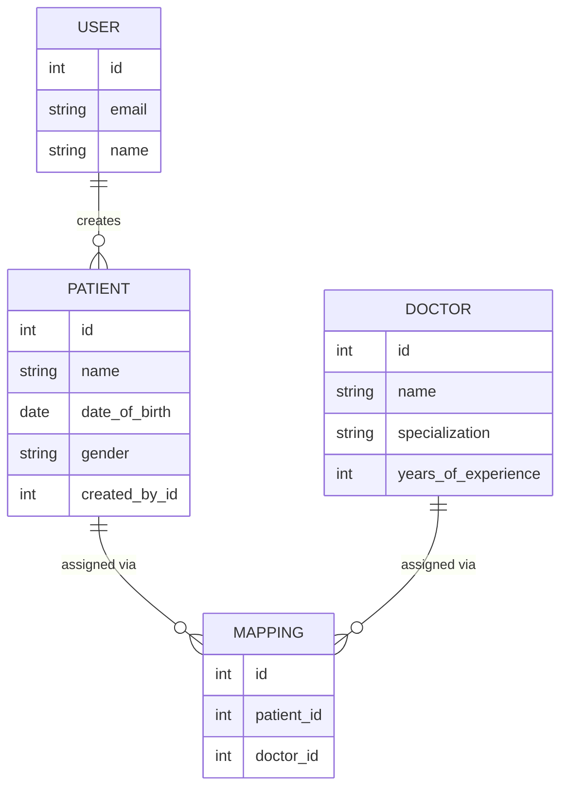

# Healthcare Backend API

A Django REST Framework backend for a healthcare application: JWT-authenticated users manage their own patient records, browse a shared doctor directory, and assign doctors to patients.

[](https://github.com/AshrafAhmed9/healthcare-backend-api/actions/workflows/ci.yml)

**Live API:** https://healthcare-backend-api-0y2l.onrender.com/api/
**Live Swagger docs:** https://healthcare-backend-api-0y2l.onrender.com/api/docs/

> Hosted on Render's free tier — the first request after idle may take ~30s to cold-start.

Pre-seeded demo login: `livetest@test.com` / `StrongPass123!` (2 doctors, 2 patients, 2 mappings already created).

## Stack

Django 5.2 · Django REST Framework · PostgreSQL · `djangorestframework-simplejwt` · `drf-spectacular` (OpenAPI/Swagger) · pytest · Docker

## Data model



## Quickstart — Docker (recommended)

```bash
cp .env.example .env
docker compose up --build
```

The web service waits for Postgres's healthcheck before running migrations, so the first `up` works with no manual steps. API is at `http://localhost:8000/api/`, Swagger UI at `http://localhost:8000/api/docs/`.

Populate demo data (a user, doctors, patients, and mappings) so the API isn't empty:

```bash
docker compose exec web python manage.py seed_demo
# demo@healthcare.dev / DemoPass123!
```

## Quickstart — local

```bash
python3.12 -m venv venv && source venv/bin/activate
pip install -r requirements-dev.txt

createdb healthcare
cp .env.example .env   # fill in DB_USER / DB_PASSWORD for your local Postgres

python manage.py migrate
python manage.py runserver
```

## Environment variables

| Variable | Purpose |
|---|---|
| `SECRET_KEY` | Django secret key |
| `DEBUG` | `True`/`False` |
| `ALLOWED_HOSTS` | Comma-separated hostnames |
| `DB_NAME`, `DB_USER`, `DB_PASSWORD`, `DB_HOST`, `DB_PORT` | PostgreSQL connection |

## Authentication

Register or log in to get a JWT pair. Send `Authorization: Bearer <access_token>` on every other request.

```bash
curl -X POST localhost:8000/api/auth/register/ \
  -H "Content-Type: application/json" \
  -d '{"email":"alice@test.com","name":"Alice","password":"StrongPass123!"}'
```

```json
{
  "user": {"id": 1, "email": "alice@test.com", "name": "Alice", "created_at": "..."},
  "access": "<jwt>",
  "refresh": "<jwt>"
}
```

## API reference

All endpoints except register/login require the bearer token above. A `postman_collection.json` is included — its Login request auto-saves the token to a collection variable.

### Auth

| Method | Endpoint | Description |
|---|---|---|
| POST | `/api/auth/register/` | Register with name, email, password |
| POST | `/api/auth/login/` | Log in, returns `access` + `refresh` |
| POST | `/api/auth/refresh/` | Exchange a refresh token for a new access token |
| GET | `/api/auth/me/` | Current authenticated user |

### Patients — scoped to the requesting user

| Method | Endpoint | Description |
|---|---|---|
| POST | `/api/patients/` | Create a patient (you become `created_by`) |
| GET | `/api/patients/` | List **your** patients |
| GET | `/api/patients/<id>/` | Retrieve one of your patients |
| PUT | `/api/patients/<id>/` | Update one of your patients |
| DELETE | `/api/patients/<id>/` | Delete one of your patients |

A patient created by another user is invisible here — the queryset is filtered to `request.user`, so accessing another user's patient by id returns `404`, not `403`. This is the assignment's core security requirement.

```json
// POST /api/patients/
{"name": "John Doe", "date_of_birth": "1990-01-01", "gender": "M"}
```

### Doctors — shared across all users

| Method | Endpoint | Description |
|---|---|---|
| POST | `/api/doctors/` | Add a doctor |
| GET | `/api/doctors/` | List all doctors |
| GET | `/api/doctors/<id>/` | Retrieve a doctor |
| PUT | `/api/doctors/<id>/` | Update a doctor |
| DELETE | `/api/doctors/<id>/` | Delete a doctor |

```json
// POST /api/doctors/
{"name": "Dr Smith", "specialization": "CARDIOLOGY", "email": "drsmith@test.com", "years_of_experience": 10}
```

### Mappings — assign doctors to your patients

| Method | Endpoint | Description |
|---|---|---|
| POST | `/api/mappings/` | Assign a doctor to one of **your** patients |
| GET | `/api/mappings/` | List mappings for your patients |
| GET | `/api/mappings/<patient_id>/` | Doctors assigned to a specific patient |
| DELETE | `/api/mappings/<id>/` | Remove a mapping |

```json
// POST /api/mappings/
{"patient": 1, "doctor": 1}
```

**A deliberate design note:** the spec defines `GET /api/mappings/<patient_id>/` and `DELETE /api/mappings/<id>/` on the same URL shape, but `<patient_id>` and `<id>` mean different things — a patient id versus a mapping id. A single DRF router can't express two id meanings for one path, so both are handled by one view (`mappings/views.py::MappingDetailView`) that dispatches on HTTP method. Attempting to assign a doctor to a patient you don't own is rejected with a `400` and a clear message — this is checked independently of the patient-visibility rule above, since a patient id can be valid without belonging to you.

## Error format

Every error response (validation, auth, not-found) is shaped consistently by a custom DRF exception handler (`config/exceptions.py`):

```json
{"success": false, "message": "Validation failed.", "errors": {"date_of_birth": ["Date of birth cannot be in the future."]}}
```

## Testing

```bash
pytest --cov --cov-report=term-missing --cov-fail-under=90
```

32 tests across all four apps, 97% coverage. Beyond CRUD happy paths, the suite specifically proves the security requirements: every protected endpoint returns `401` unauthenticated, another user's patient returns `404`, and mapping a doctor to another user's patient is rejected.

## Linting

```bash
ruff check .
ruff format --check .
```

## CI

`.github/workflows/ci.yml` runs on every push/PR: lint, a `makemigrations --check` drift guard, and the full test suite with coverage enforcement, against a real Postgres service container.

## Design decisions

- **Custom user model, email as login** (`accounts.User`) — the spec registers users by name/email/password with no username, so email is the natural `USERNAME_FIELD`. Set before the first migration, since changing `AUTH_USER_MODEL` after migrating requires rebuilding the database.
- **`date_of_birth` stored, `age` derived** — age is not a stable fact to persist; it changes every year and would silently go stale. It's computed in the serializer instead.
- **Ownership enforced at the queryset**, not per-view checks — `Patient.objects.filter(created_by=request.user)` makes leaking another user's row structurally impossible rather than dependent on remembering a check in every method.
- **No service layer, caching, or role system** — the assignment is 15 endpoints of CRUD. Adding architecture layers that don't serve a real requirement here would make the code harder to read, not more impressive.
